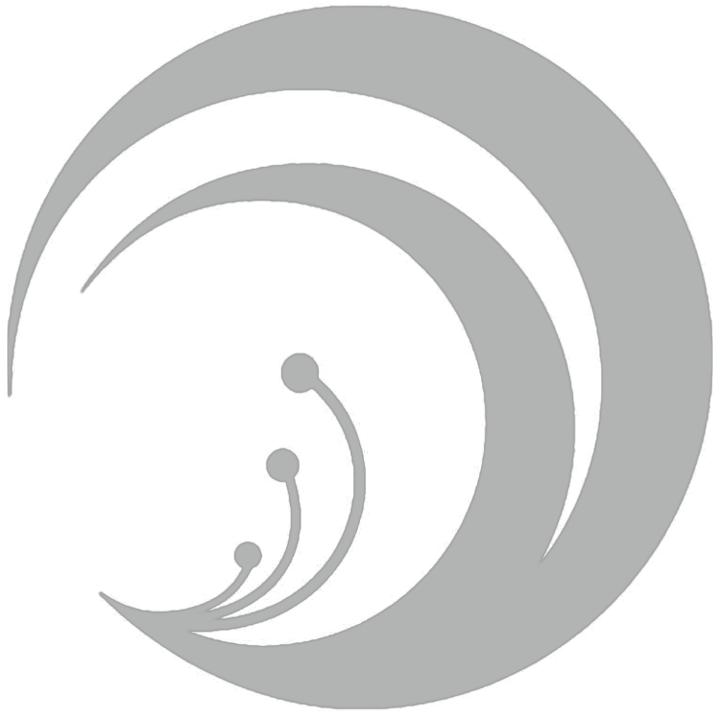

<p align="center">
  
</p>

# ReCoSplat: Online Feed-Forward Gaussian Splatting via Render-and-Compare

<p align="center">
  <a href="https://arxiv.org/abs/2603.09968">Paper</a> ·
  <a href="https://freemancheng.com/ReCoSplat/">Project Page</a> ·
  <a href="https://huggingface.co/chfrn/ReCoSplat">Model</a>
</p>

Official inference and evaluation code of **ReCoSplat: Online Feed-Forward Gaussian Splatting via Render-and-Compare**.

Freeman Cheng, Botao Ye, Xueting Li, Junqi You, Fangneng Zhan, Ming-Hsuan Yang

## 📖 Abstract

Online novel view synthesis requires a model to reconstruct a scene causally from a stream of observations while keeping it renderable at every moment.
We present **ReCoSplat**, an online feed-forward Gaussian Splatting model supporting both posed and unposed inputs, with or without camera intrinsics.
While assembling local Gaussians with camera poses scales better than canonical-space prediction, stable training requires ground-truth poses, creating a distribution mismatch when predicted poses are used at inference.
To address this, we introduce a Render-and-Compare (ReCo) module.
ReCo renders the accumulated scene from the viewpoint of the incoming observation, comparing the render with the observation to produce a stable conditioning signal that helps bridge the mismatch.
To support long sequences, we propose a hybrid KV-cache compression strategy combining early-layer truncation with chunk-level selective retention, reducing the KV cache size by over 90% for 100 or more frames.
ReCoSplat achieves state-of-the-art performance among online methods while processing 256-view streams at an average input throughput of 45.1 FPS, with an end-of-stream throughput of 41.1 FPS on an RTX 6000 Ada GPU.
Code and pretrained models are available.

## 🛠️ Installation

The tested environment uses Python 3.10, PyTorch 2.5.1, and CUDA 12.1.

```bash
git clone https://github.com/peelstnac/ReCoSplat.git
cd ReCoSplat

export CUDA_HOME=/usr/local/cuda-12.1
uv sync --frozen
```

### 📥 Model checkpoint

Download the released 224×224 checkpoint from [Hugging Face](https://huggingface.co/chfrn/ReCoSplat):

```bash
mkdir -p weights
uvx --from huggingface_hub hf download chfrn/ReCoSplat \
  recosplat.safetensors --local-dir weights
```

The commands below use `weights/recosplat.safetensors` by default.

## 📁 Evaluation datasets

The JSON files under `assets/<dataset>/nvs/` define the exact scene keys and context and target frame indices for each evaluation protocol.
The preparation script takes the union of these requirements, converts the required scenes, and writes lossless 224×224 PNGs into approximately 200 MB PyTorch chunks that can be reused across protocols:

```text
dataset_root/
└── test/
    ├── 000000.torch
    └── ...
```

Each chunk contains scene dictionaries with a string `key`, a `[num_frames, 18]` camera tensor, and PNG byte tensors in `images`.
A camera row is `[fx, fy, cx, cy, 0, 0, w2c_3x4.flatten()]`; intrinsics are normalized by image width and height, and extrinsics follow the OpenCV convention.
Use `--workers` to control parallel image conversion and `--chunk-size-mb` to change the target chunk size.

| Dataset config | Stored image size | Model input size |
| --- | ---: | ---: |
| `dl3dv`, `scannet`, `scannetpp` | 224×224 | 224×224 |
| `re10k`, `acid` | 360×640 | 224×224 |

RealEstate10K and ACID use the upstream pixelSplat chunks and are resized by the loader.
The other datasets are stored at the final resolution to reduce disk usage.

<details>
<summary><strong>DL3DV</strong></summary>

The source data is the official [DL3DV 960P Benchmark archive](https://huggingface.co/datasets/DL3DV/DL3DV-Benchmark) on Hugging Face, using its `images_4` images.
The four ReCoSplat index files under `assets/DL3DV/nvs/` select the same 140 scene keys and define the context and target frames for the 32-, 64-, 128-, and 256-view protocols.
The official archive has one directory per scene hash, with `nerfstudio/transforms.json` and `nerfstudio/images_4/` below it.
Run the converter on the official archive to create the ReCoSplat 224×224 evaluation chunks:

```bash
uv run python scripts/prepare_dataset.py dl3dv \
  /path/to/DL3DV-Benchmark /path/to/dl3dv_224
```

If you use the separately distributed ReCoSplat DL3DV chunks, skip this conversion because those `.torch` files are the converted 224×224 evaluation data.

</details>

<details>
<summary><strong>ScanNet</strong></summary>

Download the [FreeSplat preprocessed ScanNet data](https://github.com/wangys16/FreeSplat#-acquiring-datasets).
The input must contain `test/scene*/color/`, `intrinsic/intrinsic_color.txt`, and `extrinsics.npy`.

```bash
uv run python scripts/prepare_dataset.py scannet \
  /path/to/freesplat/scannet /path/to/scannet_224
```

</details>

<details>
<summary><strong>ScanNet++</strong></summary>

Download the iPhone data from [ScanNet++](https://scannetpp.mlsg.cit.tum.de/scannetpp/).
Each scene must contain `iphone/rgb/` and `iphone/nerfstudio/transforms.json`.

```bash
uv run python scripts/prepare_dataset.py scannetpp \
  /path/to/scannetpp /path/to/scannetpp_224
```

</details>

<details>
<summary><strong>RealEstate10K and ACID</strong></summary>

Use the preprocessed chunks linked in [pixelSplat's dataset instructions](https://github.com/dcharatan/pixelsplat#acquiring-datasets).
These datasets already use the chunk schema expected by ReCoSplat and do not require the preparation script.

</details>

## 🔔 Bells and whistles

<details>
<summary><strong>DL3DV 140-scene split</strong></summary>

The official DL3DV 960P Benchmark archive contains 141 scenes, all disjoint from the 9,894 DL3DV training scenes.
ReCoSplat evaluates 140 of these scenes and differs from the [DL3DV-140 preview](https://dl3dv-10k.github.io/DL3DV-Benchmark-Preview/) by one scene: it includes `0f8ac521439691fe429e9efbed8d5ded1cee35bcf52d47731fb60d5a2ff661a7` instead of `07d9f9724ca854fae07cb4c57d7ea22bf667d5decd4058f547728922f909956b`.
The provided JSON indices and converter use this 140-scene split.

</details>

## 📊 Reproduce the paper results

The files in `assets/` fix the context and target indices used by every protocol.
Set the roots for the datasets you want to evaluate:

```bash
export DL3DV_ROOT=/path/to/dl3dv_224
export SCANNET_ROOT=/path/to/scannet_224
export SCANNETPP_ROOT=/path/to/scannetpp_224
export RE10K_ROOT=/path/to/re10k
export ACID_ROOT=/path/to/acid
```

Evaluate one protocol:

```bash
CUDA_VISIBLE_DEVICES=0 uv run python scripts/evaluate.py \
  dataset=dl3dv eval=dl3dv_32 input_mode=unposed_calibrated
```

Input modes are `unposed_uncalibrated`, `unposed_calibrated`, and `posed_calibrated`.
Results are written to `outputs/evaluation/recosplat/<input_mode>/<protocol>/`.

Run the complete novel-view-synthesis, camera-pose, or combined evaluation suite:

```bash
CUDA_VISIBLE_DEVICES=0 uv run python scripts/reproduce_results.py quality
CUDA_VISIBLE_DEVICES=0 uv run python scripts/reproduce_results.py pose
CUDA_VISIBLE_DEVICES=0 uv run python scripts/reproduce_results.py all
```

The reference CSV files in [`results/`](results/) contain ReCoSplat's reported values from the paper's novel-view-synthesis and camera-pose tables.
Compare completed runs against them with:

```bash
uv run python scripts/verify_results.py outputs/evaluation --suite all
```

Use `--datasets dl3dv scannet scannetpp` to verify only a completed dataset subset.
The verifier requires exact scene counts and allows deviations of 0.10 dB PSNR, 0.005 SSIM/LPIPS, and 0.005 pose AUC.

## 🚀 Run on a custom COLMAP scene

The input must be an undistorted COLMAP scene with registered `PINHOLE` or `SIMPLE_PINHOLE` cameras:

```text
my_scene/
├── images/
└── sparse/0/
    ├── cameras.bin
    └── images.bin
```

COLMAP text models (`cameras.txt` and `images.txt`) are also supported.
Run inference and export the Gaussian scene with:

```bash
CUDA_VISIBLE_DEVICES=0 uv run python scripts/infer_colmap.py /path/to/my_scene \
  --output-dir outputs/colmap \
  --max-views 64
```

Images are ordered by filename.
Use `--image-list path/to/images.txt` to provide an explicit order, one COLMAP image name per line.
`--stride` and `--max-views` can reduce the number of input views when GPU memory is limited.

The command writes:

```text
outputs/colmap/my_scene/
├── cameras.json
├── images/
├── input.ply
├── sparse/0/
└── point_cloud/iteration_0/point_cloud.ply
```

`point_cloud.ply` uses the standard degree-3 3DGS fields for position, spherical-harmonic color, opacity, scale, and rotation.
Unused higher-order color terms are zero.
`cameras.json` contains the normalized camera poses, focal lengths, principal points, and image sizes.
The processed images and COLMAP text model use the same 224×224 camera calibration.

The exported directory can be opened with the [reference 3DGS viewer](https://github.com/graphdeco-inria/gaussian-splatting):

```bash
SIBR_gaussianViewer_app -m outputs/colmap/my_scene \
  -s outputs/colmap/my_scene
```

## 🙏 Acknowledgements

ReCoSplat builds on [YoNoSplat](https://github.com/peelstnac/YoNoSplat) and uses components or conventions from [DINOv2](https://github.com/facebookresearch/dinov2), [DUSt3R](https://github.com/naver/dust3r), [pixelSplat](https://github.com/dcharatan/pixelsplat), [gsplat](https://github.com/nerfstudio-project/gsplat), and [3D Gaussian Splatting](https://github.com/graphdeco-inria/gaussian-splatting).
We thank the authors for making their work available.

## 📝 Citation

If you find ReCoSplat useful, please cite:

```bibtex
@article{cheng2026recosplat,
  title   = {ReCoSplat: Online Feed-Forward Gaussian Splatting via Render-and-Compare},
  author  = {Cheng, Freeman and Ye, Botao and Li, Xueting and You, Junqi and
             Zhan, Fangneng and Yang, Ming-Hsuan},
  journal = {arXiv preprint arXiv:2603.09968},
  year    = {2026}
}
```
